# Slowly Changing Dimensions (SCD Type 1) Pipeline — Snowflake

## Overview

This project demonstrates a **production-style Slowly Changing Dimensions (SCD Type 1)** data pipeline implemented entirely using **Snowflake-native automation** and **AWS S3**.

The purpose of this project is to show how **incoming dimensional data changes** can be automatically detected, ingested, and applied so that the **most recent values overwrite existing records**, with **no historical tracking**, which is the defining behavior of SCD Type 1.

This repository is designed to be **recruiter-friendly** and focuses on:
- Clear architecture
- Modern, event-driven ELT patterns
- Warehouse-native orchestration
- Verifiable proof of execution

---

## High-Level Architecture

### Data Flow Summary

1. CSV data files are programmatically uploaded to an AWS S3 bucket
2. Snowpipe automatically ingests new files into a Snowflake raw/source table
3. A Snowflake Stream tracks newly ingested rows
4. A Snowflake Task runs on a schedule **only when new data exists**
5. A stored procedure applies SCD Type 1 logic to the target table

### Architecture Diagram

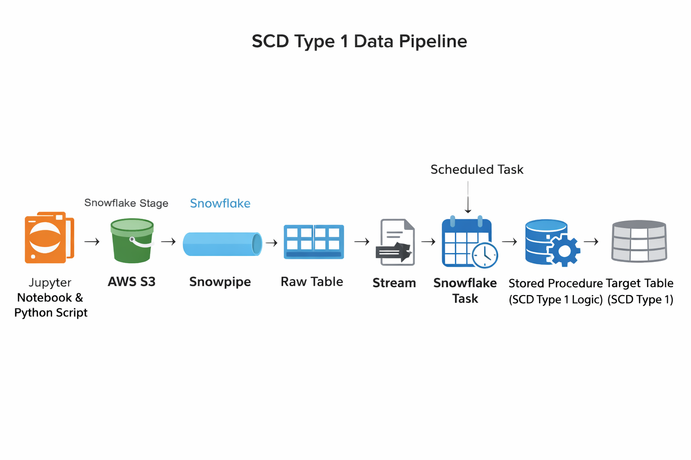

---

## Technology Stack

| Layer | Technology |
|-----|-----------|
| Cloud Storage | AWS S3 |
| Data Warehouse | Snowflake |
| Ingestion | Snowpipe (Auto-Ingest) |
| Change Detection | Snowflake Streams |
| Orchestration | Snowflake Tasks |
| Transformation | Snowflake Stored Procedure |
| Data Upload | Python (Jupyter Notebook) |

---

## Detailed Pipeline Walkthrough

### Step 1: Data Upload to S3

- A Python script running in a Jupyter Notebook uploads CSV files to an S3 bucket
- Files land in a dedicated `data/` folder
- Each file represents a new snapshot of dimensional data

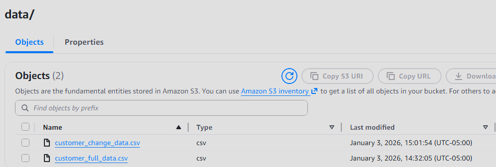

---

### Step 2: Snowflake Storage Integration and Stage

- A Snowflake storage integration securely connects Snowflake to AWS S3
- An external stage references the S3 `data/` folder
- This stage serves as the source for Snowpipe ingestion

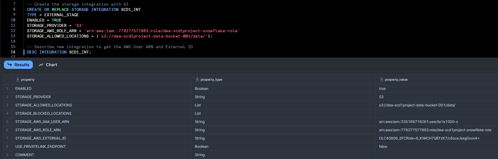
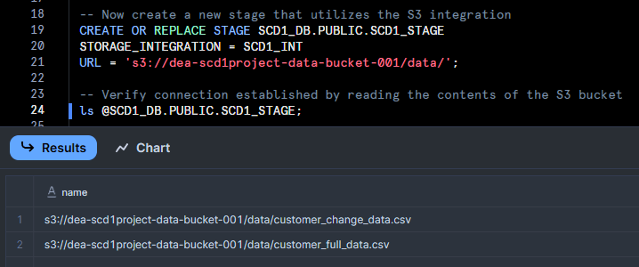

---

### Step 3: Automated Ingestion with Snowpipe

- Snowpipe is configured with auto-ingest enabled
- New files added to S3 are automatically loaded into the raw/source table
- No manual execution or scheduling is required

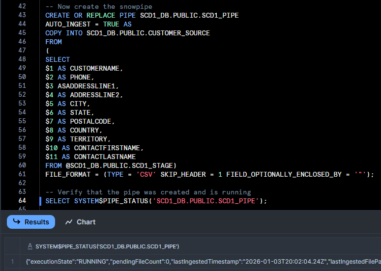
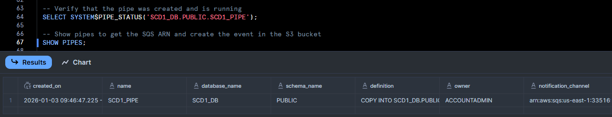

---

### Step 4: Change Tracking with Snowflake Stream

- A Snowflake Stream is created on the raw/source table
- The stream tracks newly inserted rows
- Append-only behavior ensures efficient change detection

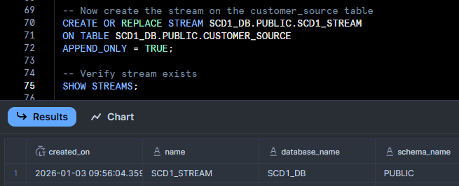

---

### Step 5: Conditional Task Execution

- A Snowflake Task is created with a one-minute schedule
- The task only runs **when the stream contains data**
- This prevents unnecessary compute usage and idle executions
- The task triggers a stored procedure

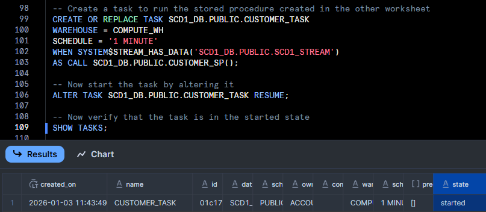

---

### Step 6: SCD Type 1 Transformation Logic

- The stored procedure reads from the stream
- Logic implemented:
  - Insert new records into the target table
  - Overwrite existing records when matching keys are found
- No historical versions are retained (true SCD Type 1 behavior)

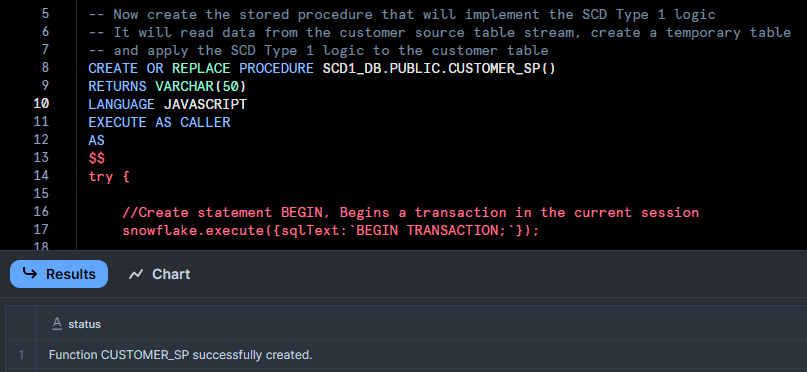

---

## Testing and Validation

### Initial Load Test

- An initial CSV file is uploaded to S3
- Data flows through Snowpipe, Stream, Task, and Stored Procedure
- Target table is populated successfully

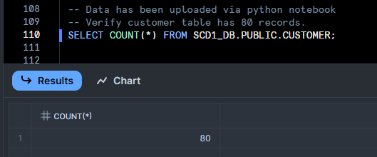
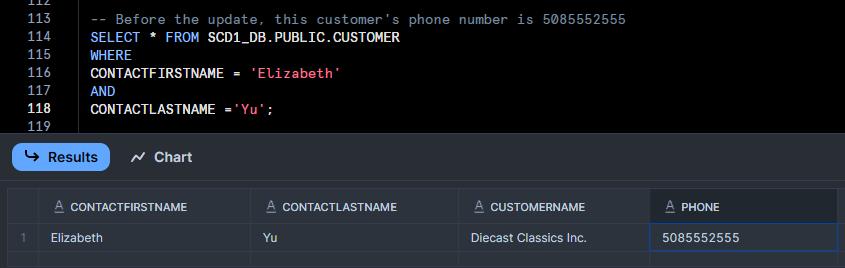
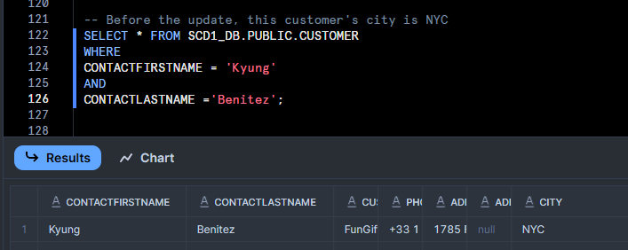
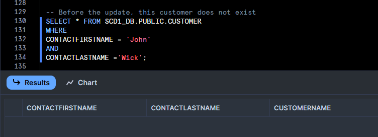

---

### Update Test (SCD Type 1 Behavior)

- A second CSV file is uploaded containing updated values
- Existing records are overwritten in the target table
- No historical data is preserved

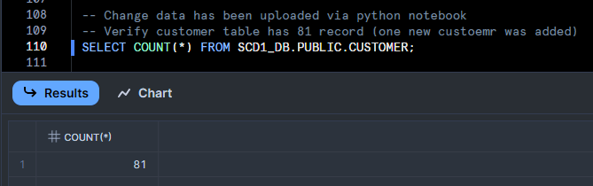
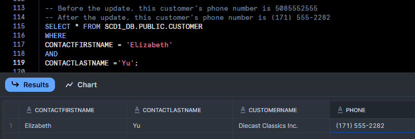
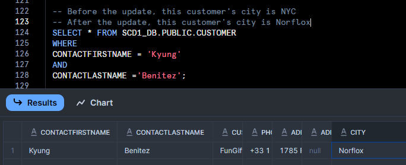
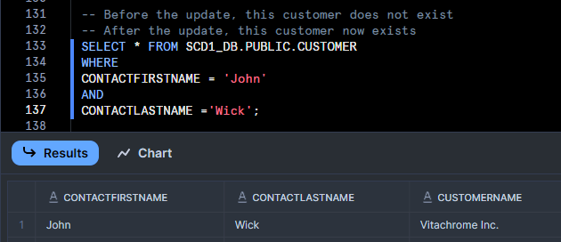

---

## Repository Structure

├── README.md  
├── architecture/  
│   └── scd1-architecture-diagram.png  
├── screenshots/   
|   ├── count-after-update.png  
|   ├── count-before-update.png  
|   ├── elizabeth-yu-after-update.png  
|   ├── elizabeth-yu-before-update.png  
|   ├── john-wick-after-update.png  
|   ├── john-wick-before-update.png  
|   ├── kyung-benitez-after-update.png  
|   ├── kyung-benitez-before-update.png  
|   ├── python-aws-user.png  
│   ├── s3-contents.png  
|   ├── s3-event-notification.png  
│   ├── snowflake-integration-details.png  
|   ├── snowflake-integration-role.png  
|   ├── snowflake-pipe-creation.png  
|   ├── snowflake-pipe-details.png  
|   ├── snowflake-procedure-creation.png  
|   ├── snowflake-stage.png  
|   ├── snowflake-stream-creation.png  
|   ├── snowflake-task-creation.png
│   └── snowflake-trust-relationship.png  
├── sql/  
│   ├── create_storage_integration.sql  
│   ├── create_stage.sql  
│   ├── create_raw_table.sql  
│   ├── create_snowpipe.sql  
│   ├── create_stream.sql  
│   ├── create_target_table.sql  
│   ├── create_stored_procedure.sql  
│   ├── create_task.sql  
|   └── validation.sql
├── python/  
│   └── upload_csv_to_s3.py 
├── data_samples/  
    ├── customer_full_data.csv  
    └── customer_change_data.csv  

---

## Key Design Decisions
- Used Snowflake-native orchestration instead of external schedulers
- Leveraged Streams + conditional Tasks to minimize compute cost
- Clear separation between raw ingestion and dimensional targets
- Designed to reflect real-world production ELT patterns
- Infrastructure can be torn down without losing proof of execution

---

## Why This Project Is Relevant
This project demonstrates practical experience with:  
- Event-driven data pipelines
- Snowflake ingestion and automation
- Dimensional modeling concepts
- Cloud IAM and secure cross-service integration
- Cost-aware warehouse orchestration

It mirrors how modern data engineering teams build scalable, automated Snowflake pipelines in production environments.

---

## Contact

If you'd like to discuss this project or my data engineering experience, feel free to connect with me on LinkedIn or explore my other repositories.

